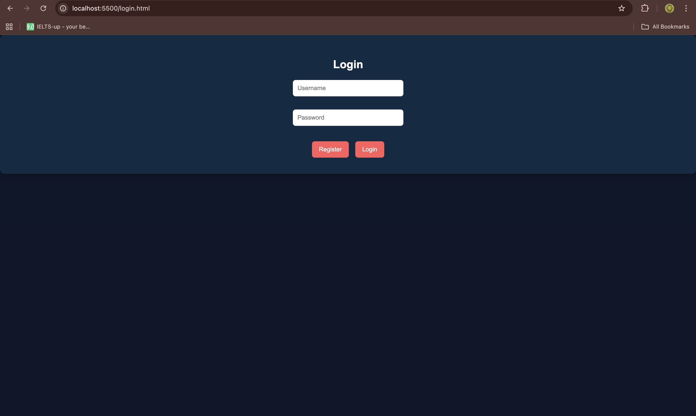
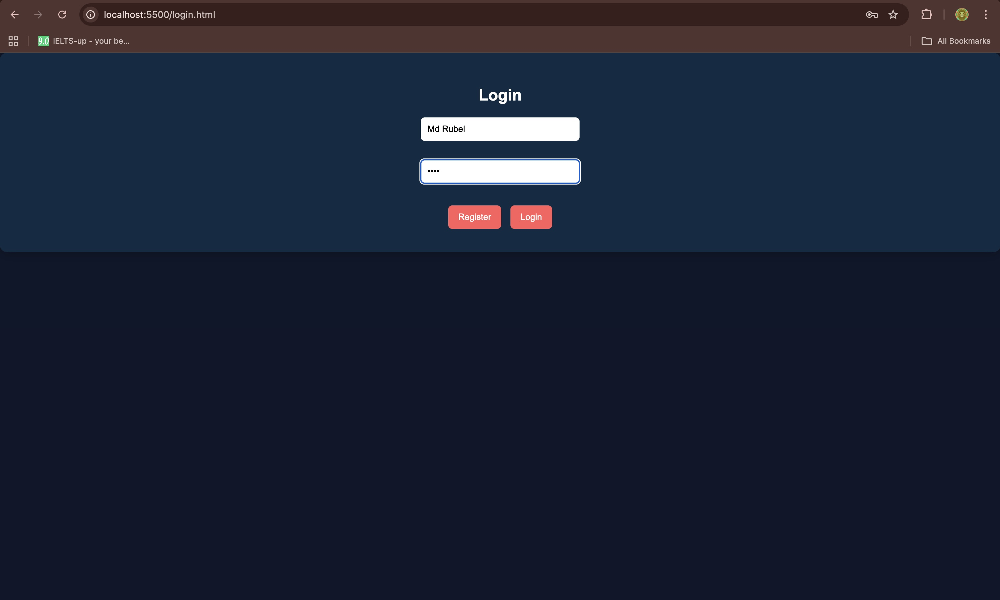
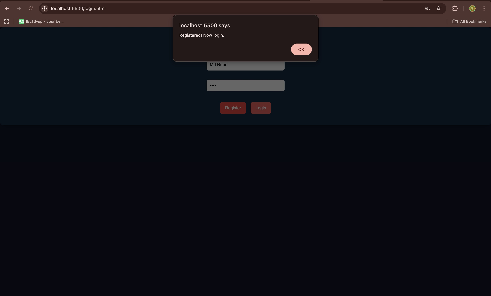
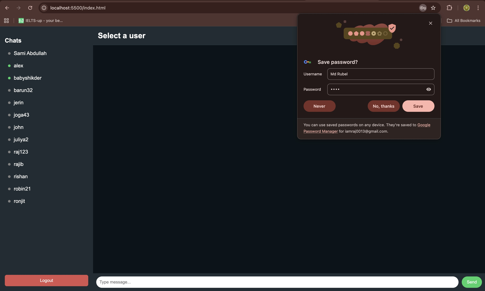
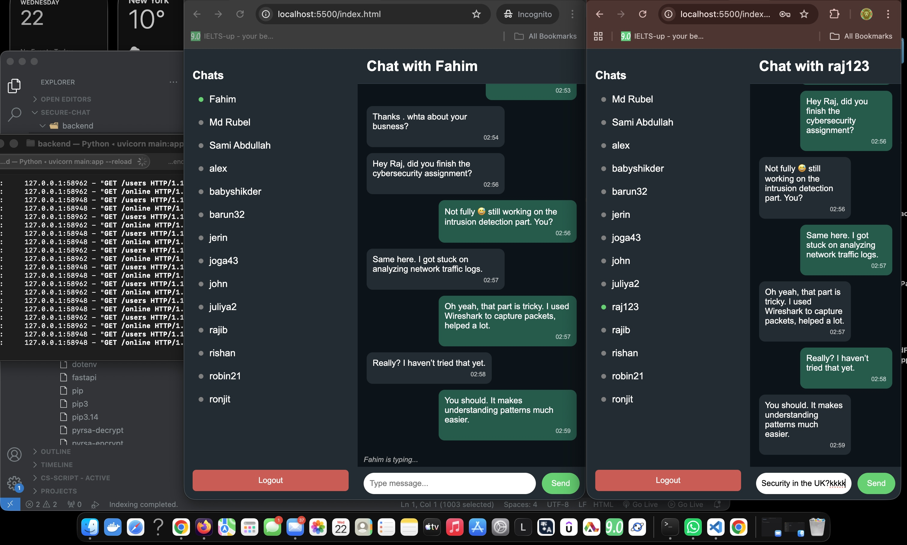

#  Secure Chat App

A real-time chat application built using FastAPI and WebSocket.

##  Features

* User Registration & Login
* Real-time Messaging (WebSocket)
* Online / Offline Status
* Typing Indicator
* Clean Chat UI

## 🛠️ Tech Stack

* Frontend: HTML, CSS, JavaScript
* Backend: FastAPI (Python)
* Database: SQLite
* WebSocket for real-time communication

## 📸 Screenshots

### 🔐 Login Page


### 📝 Register Page


### ✅ Registration Success


### 💬 Chat Interface


### 📊 Monitoring

## How to Run

### Backend

```bash
cd backend
uvicorn main:app --reload
```

### Frontend

```bash
cd frontend
python3 -m http.server 5500
```

Open browser:
http://localhost:5500

##  Project Purpose

This project demonstrates real-time communication using WebSocket and secure system design.
It is built as part of a cybersecurity and software development portfolio.

## 👨‍💻 Author

Rajib Das
